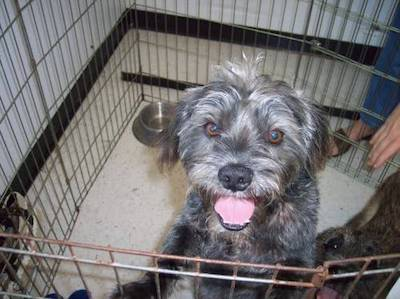
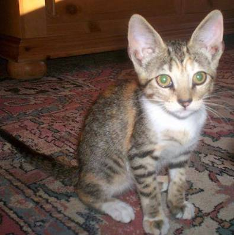

# Dogs vs Cats

Classification model to distinguishing images of dogs vs cats.

 

## Dataset

Images of dogs and cats. Labels are 1 = dog and 0 = cat.

| Train images | Test images |
| :-------------: | :-------------:|
| 25,000 | 12,500 |

https://www.kaggle.com/c/dogs-vs-cats/data

## Technologies

* [numpy](http://www.numpy.org)
* [pandas](https://pandas.pydata.org/)
* [matplotlib](https://matplotlib.org/)
* [scikit-learn](https://scikit-learn.org/)
* [pillow](https://pillow.readthedocs.io/)
* [keras](https://keras.io)
* [tensorflow](https://www.tensorflow.org/)
* [jupyter](https://jupyter.org/)

## Deployment

### Virtual Environment using Bash

1. Creation of a virtual environments done by executing the command venv
2. Command to activate virtual environment
3. Install dependencies
4. List the libraries installed on your environment
5. Do your work!
6. When you are done, the command to deactivate virtual environment
```
$ python3 -m venv env/
$ source env/bin/activate
(env) $ pip install -r requirements.txt
(env) $ pip freeze
(env) $ ...
(env) $ deactivate
```

## Resources

* https://www.kaggle.com/uysimty/keras-cnn-dog-or-cat-classification
* https://github.com/gsurma/image_classifier/blob/master/image_classifier.ipynb